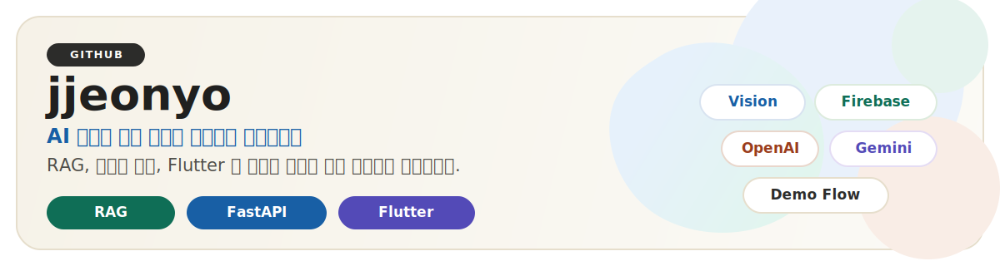

<!-- GitHub profile README draft for https://github.com/jjeonyo -->

  

  
  
  

## 소개

검색 기반 답변, 백엔드 서비스, 사용자 인터페이스를 하나의 흐름으로 묶어 실제로 동작하는 AI 경험을 만드는 개발자입니다.

최근에는 아래 주제에 집중하고 있습니다.

- 매뉴얼과 구조화 데이터를 기반으로 한 RAG 응답 설계
- Flutter 클라이언트와 FastAPI, Spring Boot, Firebase, Supabase 연결
- 채팅, 비전, 영상 생성 흐름을 데모 가능한 제품 형태로 구현

## 대표 프로젝트

<table>
  <tr>
    <td width="50%" valign="top">
      <h3><a href="https://github.com/jjeonyo/lgdx_backend">lgdx_backend</a></h3>
      
검색 기반 상담, 채팅 저장, 미디어 생성까지 연결한 AI 지원 흐름의 백엔드 레포지토리입니다.

      
<strong>핵심 포인트</strong> FastAPI 기반 서비스 Firestore 메시지 흐름 Gemini 및 영상 생성 파이프라인

    </td>
    <td width="50%" valign="top">
      <h3><a href="https://github.com/jjeonyo/lgdx_frontend">lgdx_frontend</a></h3>
      
채팅, 라이브 카메라, 영상 재생 경험을 하나로 묶은 Flutter 클라이언트입니다.

      
<strong>핵심 포인트</strong> Flutter 화면 구성 Firebase 연동 미디어 중심 사용자 경험

    </td>
  </tr>
  <tr>
    <td width="50%" valign="top">
      <h3><a href="https://github.com/jjeonyo/vision">vision</a></h3>
      
LangChain, 임베딩, 벡터 검색을 활용해 매뉴얼 기반 지원 흐름을 실험한 프로토타입입니다.

      
<strong>핵심 포인트</strong> LangChain 검색 체인 Supabase 벡터 검색 매뉴얼 업로드 및 테스트 스크립트

    </td>
    <td width="50%" valign="top">
      <h3><a href="https://github.com/jjeonyo/DX_project">DX_project</a></h3>
      
크롤링, 전처리, 클러스터링, 감성 분석까지 이어지는 텍스트 마이닝 및 임베딩 실험 저장소입니다.

      
<strong>핵심 포인트</strong> Python 노트북 및 스크립트 OpenAI 및 토큰 기반 처리 데이터 준비 워크플로우

    </td>
  </tr>
</table>

## 프로젝트 미리보기

아래 카드는 각 대표 저장소의 GitHub 미리보기입니다. 클릭하면 바로 저장소로 이동합니다.

<table>
  <tr>
    <td width="50%" valign="top">
      
    </td>
    <td width="50%" valign="top">
      
    </td>
  </tr>
  <tr>
    <td width="50%" valign="top">
      
    </td>
    <td width="50%" valign="top">
      
    </td>
  </tr>
</table>

## 기술 스택

  
  
  
  
  
  
  
  
  

## 현재 집중하고 있는 것

- 더 신뢰할 수 있는 매뉴얼 기반 어시스턴트 만들기
- 프로젝트 문서화와 저장소 표현력 개선하기
- 실험 결과를 데모 가능한 제품 형태로 다듬기

## 함께 보면 좋은 저장소

- <a href="https://github.com/jjeonyo/jhj4862123.io">jhj4862123.io</a> : 개인 사이트 배포 저장소
- <a href="https://github.com/jjeonyo/Algorithm">Algorithm</a> : 알고리즘 학습 및 풀이 기록

  
추천 pinned repositories

   

  <a href="https://github.com/jjeonyo/lgdx_backend">lgdx_backend</a> 
  <a href="https://github.com/jjeonyo/lgdx_frontend">lgdx_frontend</a> 
  <a href="https://github.com/jjeonyo/vision">vision</a> 
  <a href="https://github.com/jjeonyo/DX_project">DX_project</a> 
  <a href="https://github.com/jjeonyo/Algorithm">Algorithm</a> 
  <a href="https://github.com/jjeonyo/jhj4862123.io">jhj4862123.io</a>

