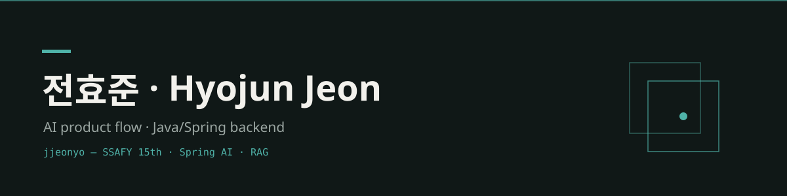
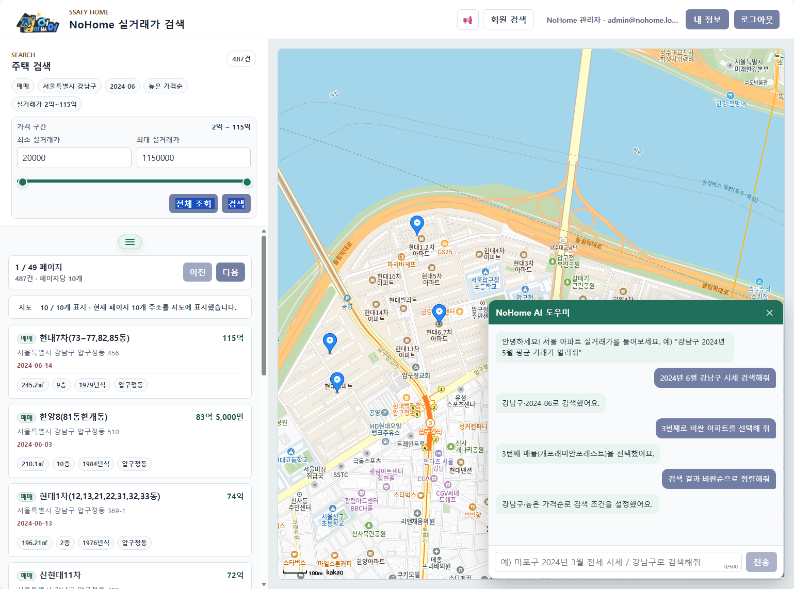

  

  
  
  

## 소개 · About

AI 기능을 실제 서비스 흐름으로 연결하는 개발자, 전효준입니다.
*I build working AI product flows — from RAG pipelines to Spring backends and client UX.*

- RAG·생성형 응답을 제품 시나리오로 묶는 백엔드 orchestration
- Spring Boot, FastAPI 서버와 Flutter, Vue 클라이언트 연결
- SSAFY 15기 Java 전공 트랙 이수 중 — Spring Boot & Spring AI 심화

## 대표 프로젝트 · Featured

<table>
  <tr>
    <td width="50%" valign="top">
      <h3><a href="https://github.com/repechage-team/no-home-backend">NoHome</a></h3>
      
<em>아파트 실거래가 검색 서비스 · SSAFY 팀 프로젝트</em>

      
      
국토교통부 공공데이터 실거래가를 수집·저장합니다. 매매/전세/월세 통합 검색과 Kakao Map 위치 확인, Spring AI 챗봇 질의를 함께 제공합니다.

      
<strong>핵심 포인트</strong> coverage 기반 자동 데이터 수집 흐름 설계 Spring Boot · Spring AI · MyBatis · MySQL Vue · Vite · Kakao Map · Docker Compose

      
<a href="https://github.com/repechage-team/no-home-backend">backend</a> · <a href="https://github.com/repechage-team/no-home-frontend">frontend</a> · <a href="https://github.com/repechage-team/no-home-artifact">artifact</a>

    </td>
    <td width="50%" valign="top">
      <h3><a href="https://github.com/jjeonyo/lgdx_backend">LGDX</a></h3>
      
<em>매뉴얼 기반 AI 사용자 지원 · FastAPI + Flutter</em>

      

        
      

      
매뉴얼 검색, RAG 답변, 영상 생성, 상태 저장을 하나의 흐름으로 연결한 AI 지원 서비스입니다. 백엔드 orchestration과 클라이언트 UX를 함께 구현했습니다.

      
<strong>핵심 포인트</strong> RAG 기반 답변 흐름 설계 FastAPI · Firestore · Supabase 연동 Flutter 채팅·라이브·재생 화면 흐름

      
<a href="https://github.com/jjeonyo/lgdx_backend">backend</a> · <a href="https://github.com/jjeonyo/lgdx_frontend">frontend</a>

    </td>
  </tr>
</table>

## GitHub 통계 · Stats

  
  

## 기술 스택 · Tech Stack

**Backend**

**AI**

**Client**

**Infra**

## 지금은 · Now

- SSAFY 15기 Java 전공 트랙 — Spring 백엔드 심화 학습
- 꾸준한 알고리즘 문제 풀이 → [Algorithm](https://github.com/jjeonyo/Algorithm)
