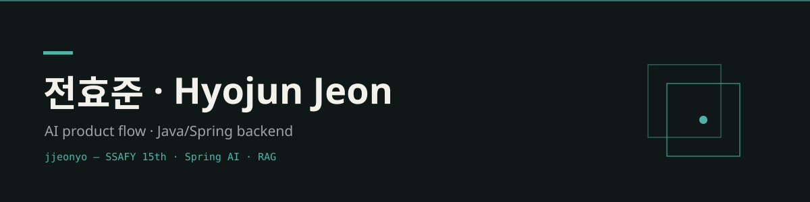
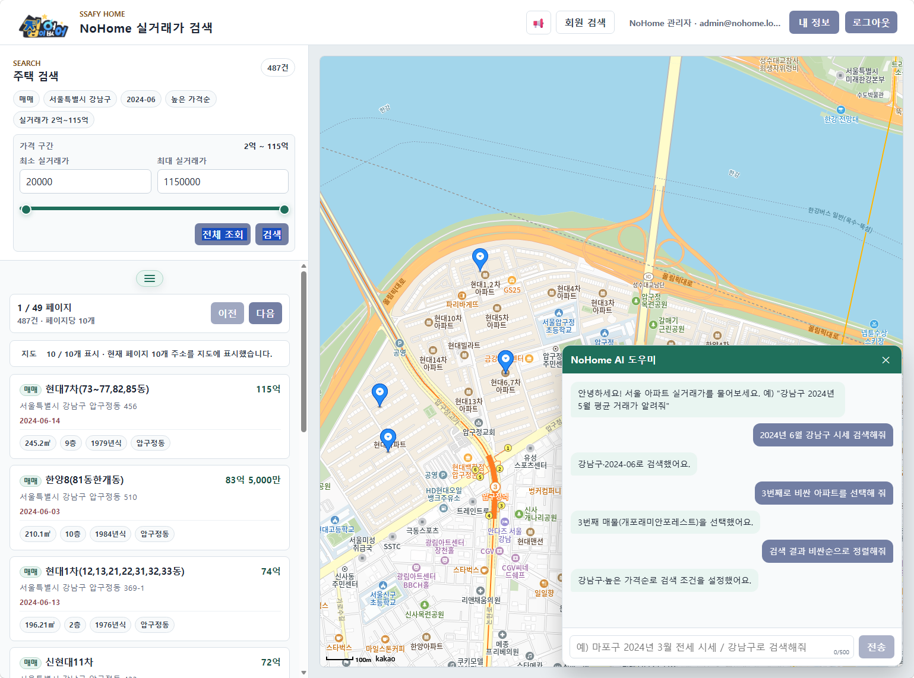
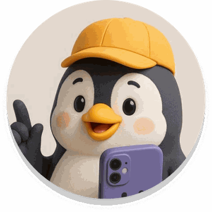

<p align="center">
  
</p>

<p align="center">
  <a href="https://github.com/jjeonyo"></a>
  
  
  <a href="./portfolio/Hyojun_Jeon_Portfolio.pdf"></a>
</p>

## 소개 · About

AI 기능을 실제 서비스 흐름으로 연결하는 개발자, 전효준입니다.<br />
*I build working AI product flows — from RAG pipelines to Spring backends and client UX.*

- RAG·생성형 응답을 제품 시나리오로 묶는 백엔드 orchestration
- Spring Boot, FastAPI 서버와 Flutter, Vue 클라이언트 연결
- SSAFY 15기 Java 전공 트랙 이수 중 — Spring Boot & Spring AI 심화

## 대표 프로젝트 · Featured

<table>
  <tr>
    <td width="50%" valign="top">
      <h3><a href="https://github.com/repechage-team/no-home-backend">NoHome</a></h3>
      <p><em>아파트 실거래가 검색 서비스 · SSAFY 팀 프로젝트</em></p>
      <a href="https://github.com/repechage-team/no-home-backend">
        
      </a>
      <p>국토교통부 공공데이터 실거래가를 수집·저장합니다. 매매/전세/월세 통합 검색과 Kakao Map 위치 확인, Spring AI 챗봇 질의를 함께 제공합니다.</p>
      <p><strong>핵심 포인트</strong><br />coverage 기반 자동 데이터 수집 흐름 설계<br />Spring Boot · Spring AI · MyBatis · MySQL<br />Vue · Vite · Kakao Map · Docker Compose</p>
      <p><a href="https://github.com/repechage-team/no-home-backend">backend</a> · <a href="https://github.com/repechage-team/no-home-frontend">frontend</a> · <a href="https://github.com/repechage-team/no-home-artifact">artifact</a></p>
    </td>
    <td width="50%" valign="top">
      <h3><a href="https://github.com/jjeonyo/lgdx_backend">LGDX</a></h3>
      <p><em>매뉴얼 기반 AI 사용자 지원 · FastAPI + Flutter</em></p>
      <p align="center">
        
      </p>
      <p>매뉴얼 검색, RAG 답변, 영상 생성, 상태 저장을 하나의 흐름으로 연결한 AI 지원 서비스입니다. 백엔드 orchestration과 클라이언트 UX를 함께 구현했습니다.</p>
      <p><strong>핵심 포인트</strong><br />RAG 기반 답변 흐름 설계<br />FastAPI · Firestore · Supabase 연동<br />Flutter 채팅·라이브·재생 화면 흐름</p>
      <p><a href="https://github.com/jjeonyo/lgdx_backend">backend</a> · <a href="https://github.com/jjeonyo/lgdx_frontend">frontend</a></p>
    </td>
  </tr>
</table>

## 포트폴리오 · Portfolio

AI 모델을 실제 서비스에 연결하는 AI 애플리케이션 개발자입니다. LLM · 멀티모달 · RAG · Spring/FastAPI<br />
전체 문서 → [**Portfolio PDF**](./portfolio/Hyojun_Jeon_Portfolio.pdf) · ✉️ jhj4862123@naver.com

<table>
  <tr>
    <td width="33%" valign="top">
      <strong>01 · 실시간 멀티모달 연결</strong><br />
      웹캠 영상·음성을 Gemini Live로 보내고, 음성 답과 매뉴얼 검색 도구 호출을 한 루프에서 처리했습니다.<br />
      <sub>LG ELLE · DX 우수상</sub>
    </td>
    <td width="33%" valign="top">
      <strong>02 · 직접 설계한 인증·권한</strong><br />
      세션 로그인을 JWT로 바꾸고, 리프레시 토큰 회전과 관리자 권한 검사를 백엔드부터 화면까지 구현했습니다.<br />
      <sub>NoHome · SSAFY 최우수상</sub>
    </td>
    <td width="33%" valign="top">
      <strong>03 · 근거로 검증하는 LLM</strong><br />
      주장마다 근거 원장을 붙이고, 사실 검증 에이전트와 Python 스크립트가 결과를 판정하게 했습니다.<br />
      <sub>문서 작성 멀티에이전트 파이프라인</sub>
    </td>
  </tr>
</table>

### LG ELLE — 카메라와 음성으로 가전 고장을 상담하는 실시간 에이전트
<sub>LG전자 DX School 3기 · 6인 팀 · 2025.11–12 · 실시간 루프·영상 담당 · **DX 우수상**</sub>

사용자가 세탁기를 비추며 말로 물으면 AI가 음성으로 답하고, 해결 방법을 짧은 영상으로 만들어 앱에서 재생합니다.

```
웹캠·마이크 → FastAPI /ws/chat → Gemini Live (native audio) → search_manual (RAG) → 앱 재생
0.5s JPEG · PCM16                                                    매뉴얼 검색        음성 24kHz · Veo 영상
```

- **실시간 음성·비전 루프** — 웹캠·마이크 입력을 Gemini Live로 보내고, 음성 답을 같은 루프에서 재생
- **매뉴얼 검색 도구 호출** — 모델이 `search_manual`을 직접 부르는 function calling 구현
- **문제 해결**
  - 임베딩 API 호출이 실패하면 매뉴얼 검색 전체가 멈춤 → 실패 시 영벡터로 대체해 키워드 검색 경로 유지
  - Veo 쿼터 초과(429) 시 앱이 3초 간격 상태 확인을 계속 반복 → 429 수신 시 폴링 중단 후 사용자에게 알림
- **기술** — Python · FastAPI · OpenCV · Flutter · Gemini Live API · Veo 3.1 · Supabase · Firebase

### NoHome — 공공데이터 실거래가 검색 서비스
<sub>삼성 청년 SW·AI 아카데미(SSAFY) · 3인 팀 · 2026.06 · 회원·인증, AI 도우미 tool calling 담당 · **최우수상**</sub>

국토교통부 실거래가를 적재해 검색·지도·AI 도우미를 제공하는 서비스입니다. Codex 에이전트와 함께 진행했습니다.

```
Vue 3 (HttpOnly 쿠키) → JWT → Interceptor (토큰 검증) → Spring Boot Controller·Service → MyBatis Mapper → SQL
```

- **JWT·인증 검사 직접 구현** — 라이브러리 없이 HmacSHA256으로 발급·검증, Spring Security 대신 `HandlerInterceptor`로 검사
- **관리자·회원 기능** — 관리자 전용 회원 검색, 공지사항·관심지역을 API부터 화면까지 구현
- **AI 도우미 tool calling** — Spring AI로 모델이 서비스 기능을 도구로 호출, 로그인 회원 id로 호출 제한·대화 기억 분리
- **문제 해결**
  - 리프레시 토큰 유출 시 같은 토큰으로 계속 재발급 가능 → HttpOnly 쿠키로만 전달, DB엔 해시만 저장, 한 번 쓴 토큰은 회전 후 거부
  - 탈퇴·비밀번호 재설정 뒤에도 기존 토큰 유효 → 해당 회원의 토큰 일괄 삭제
- **기술** — Java · Spring Boot · MyBatis · Vue 3 · JWT(HmacSHA256) · Spring AI · gpt-4o-mini

### 근거 기반 문서 작성 멀티에이전트 파이프라인
<sub>개인 프로젝트 · 2026.06–10</sub>

채용 공고와 마크다운 파일에 기록된 사용자 정보로 자기소개서 초안을 만드는 Claude Code 파이프라인입니다.

```
researcher (Sonnet) → writer (Opus) → verifier (Sonnet) → Python 스크립트 4종 → reader (Opus)
근거 수집              초안 작성        사실 검증            형식 검사              독자 평가
```

과제: 경력에 없는 내용이 글에 섞이지 않게 하면서, 에이전트 호출 수를 예측 가능한 범위 안에 묶기.

| 실행해 보니 | 그래서 이렇게 지시 |
| --- | --- |
| 호출이 46회까지 늘고 원고가 13개 쌓임 | 설계안 4개를 따로 받아 서로 반박하게 한 뒤 남은 안 승인 — 에이전트 6→4개, 검토 3→2회, 호출 상한 9회 |
| 경력에 없는 '이유'를 지어내 문장에 붙임 | 근거 원장에 없는 주장이 하나라도 있으면 불합격, 위반은 근거 없음·모순·과장 등 5가지로 나눠 보고 |
| 검증 에이전트가 고치면서 새 문장을 만듦 | 검증은 읽기 권한만, 수정은 삭제 또는 원문 교체만 허용 |
| 글자 수·어미 반복은 LLM이 세면 틀릴 수 있음 | 정해진 규칙은 Python 스크립트 4종이 판정 |
| 작성 에이전트의 "이 문장만 고쳤다"는 보고에 의존 | 실제로 바뀐 문장을 비교해 그 부분만 재검증 |

**결과** — 호출 수 46회 → 최대 9회 (재설계 후 3번 실행이 각각 7·8·9회로 상한 안에서 종료) · 회귀 테스트 115개 통과

### 그 밖의 작업

| 프로젝트 | 내용 | 결과 |
| --- | --- | --- |
| **전기차 충전기 점검 보고서 자동화**<br /><sub>(주)지엔텔 IT팀 · 2022.12–2023</sub> | 현장 점검 사진 폴더를 고르면 충전기별 점검 보고서(엑셀)를 자동 생성. 사진 자동 분류, openpyxl로 양식 약 27칸 채우기, Pillow로 사진 삽입, Tkinter 화면을 붙여 실행 파일로 배포 | 보고서 작업 월 약 200시간 절감 · 팀 실사용률 100% |
| **Pickshot — 베스트샷 추천 도구**<br /><sub>개인 프로젝트 · 2026.05</sub> | 비슷한 사진을 묶어 가장 잘 나온 한 장을 추천하는 데스크톱 도구. 구현은 Codex 에이전트에 맡기고 규칙을 `AGENTS.md`로 정함 — 원본 삭제 금지, 딥러닝 대신 OpenCV·이미지 해시 규칙, pytest 통과 전 완료 보고 금지 | 선명도·초점·노출·얼굴·표정·눈뜸·구도·색감 8개 지표 가중합 |
| **국내 자생식물 이미지 분류 POC**<br /><sub>(주)인포보스 인턴 · 2022.01–02</sub> | 100여 종 분류 가능성 검증. 수집 이미지 약 17만 장을 9만 8천 장으로 정리, 사전학습 VGG19 일부 층 파인튜닝, MirroredStrategy로 다중 GPU 분산 학습 (TensorFlow·Keras) | 100여 종 분류 정확도 0.78 |
| **ZOAS — 강의 STT 기록·키워드 추출**<br /><sub>순천향대 학술제 · 4인 팀 · 2021</sub> | Zoom 강의 음성을 글로 기록하고 핵심 키워드 추출. STT 연동과 음성·텍스트 전처리 담당. 온프레미스 Zeroth(약 60GB 메모리 요구) → Google Cloud STT로 전환, KR-WordRank로 키워드 추출 | 60GB 메모리 조건 → Cloud STT 전환 |

### 이력 · Experience

| 기간 | 내용 |
| --- | --- |
| 2026.08 – 현재 | 디자인하우스 전산팀 — 사내 IT 헬프데스크, 기술지원 |
| 2026.01 – 2026.06 | SSAFY 15기 Java 트랙 수료 — 관통 프로젝트 NoHome 최우수상 |
| 2025.06 – 2025.12 | LG전자 DX School 3기 이수 — 실시간 멀티모달 상담 에이전트 LG ELLE · DX 우수상 |
| 2022.10 – 2024.04 | (주)지엔텔 IT팀 사원 — 방화벽·스팸 차단 운영, DMZ 모니터링, 그룹웨어·ERP·NAS 관리, 사내 네트워크 포트 정리, 점검 보고서 자동화로 월 약 200시간 절감 |
| 2022.01 – 2022.02 | (주)인포보스 인턴 — 국내 자생식물 이미지 분류 POC |
| 2021.02 – 2022.12 | 순천향대학교 객체지향 프로그래밍 연구실 학부연구생 |
| 2017.03 – 2023.02 | 순천향대학교 컴퓨터공학과 학사 |

<table>
  <tr>
    <td width="60%" valign="top">
      <strong>수상 · Awards</strong>
      <ul>
        <li>2026.06 · SSAFY 1학기 프로젝트 경진대회 최우수상 (NoHome)</li>
        <li>2025.12 · LG전자 DX School 3기 DX 우수상 (LG ELLE)</li>
        <li>2023.12 · (주)지엔텔 올해의 우수직원상 G-STAR Award (점검 보고서 자동화)</li>
        <li>2022.07 · 순천향대 공과대학 딥러닝이해 우수상</li>
      </ul>
    </td>
    <td width="40%" valign="top">
      <strong>자격 · 어학 · Certificates</strong>
      <ul>
        <li>SQLD · 2026.03</li>
        <li>OPIc 영어 IH · 2025.09</li>
        <li>JLPT N2 · 2024.11</li>
        <li>TOEIC 840 · 2024.07</li>
      </ul>
    </td>
  </tr>
</table>

### 기술 상세 · Skills

| 분야 | 기술 | 사용처 |
| --- | --- | --- |
| LLM · 멀티모달 | Gemini Live API(native audio, function calling), Gemini 2.5 Pro·Flash, text-embedding-004, Imagen, Veo 3.1, OpenAI Sora-2·Chat API | LG ELLE |
| RAG · 검색 | Supabase RPC 검색, ChromaDB, sentence-transformers, LangChain 텍스트 분할기 | LG ELLE 매뉴얼 검색 |
| 에이전트 · 개발 도구 | Claude Code 서브에이전트, OpenAI Codex CLI, oh-my-codex, CodeRabbit | 문서 작성 파이프라인, NoHome, Pickshot |
| 백엔드 | Python FastAPI(WebSocket), Java 17·21, Spring Boot, MyBatis, Spring Batch, MySQL | LG ELLE 브리지, NoHome 인증·AI 도우미 |
| 모델 학습 | TensorFlow·Keras, OpenCV | VGG19 부분 파인튜닝, Pickshot 품질 지표 |

## GitHub 통계 · Stats

<p align="center">
  
  
</p>

## 기술 스택 · Tech Stack

**Backend**


**AI**


**Client**


**Infra**


## 지금은 · Now

- SSAFY 15기 Java 전공 트랙 — Spring 백엔드 심화 학습
- 꾸준한 알고리즘 문제 풀이 → [Algorithm](https://github.com/jjeonyo/Algorithm)
